Du hast eine großartige Idee? Viele Aufgaben in unterschiedlichen Bereichen? Organisatorisches, das sich immer wieder ändert? Viele Teammeetings und jeder hat etwas zu sagen? Mit einer Mindmap kannst du unterschiedliche Bereiche strukturieren und für andere Personen leichter zugänglich machen. In dieser Anleitung zeigen wir, wie es einfach und kostenlos geht.

## Was ist eine Mindmap?

> Eine Mindmap ist ein persönliches Werkzeug, dass dir dabei helfen kann, deine Gedanken zu ordnen. Durch bildhafte Darstellung deiner Gedanken entsteht eine Gedankenkarte. Natürlich geht dies auch gemeinsam mit anderen, im Team oder auch mit Kindern.

## So geht's

### Vorbereitung

Mindmaps können auf Papier geschrieben (z.B. Flipchart), mit Karten auf Pinnwände geheftet (z.B. Moderationskoffer) oder mit einem Programm auf dem Computer bzw. Tablet erstellt werden (z.B. App). Wir empfehlen diese Anleitung mit einem Computer bzw. Laptop durchzuführen. Die Darstellung auf kleinen Bildschirmen, wie z.B. auf einem Smartphone, ist sehr unübersicht und die Bedienung mit dem Finger umständlich.

Der erste Schritt bei der Planung ist es, das Thema oder den Anwendungszweck festzulegen. Handelt es sich z.B. um eine Ideensammlung, muss ein übergreifendes Thema als Titel benannt werden. Ein Beispiel wäre hierfür: *Welche Spielsachen haben wir bereits in unserer Einrichtung und welche Spielsachen kommen in Betracht für eine Neuanschaffung.*

**Danach folgt:**

- Die Überschrift bzw. das Thema wäre dementsprechend **Spielsachen 2020**
- Als Unterüberschrift wären es die Punkte, zum einen **haben wir**, und zum anderen **hätten wir gerne**
- Nun folgt das gemeinsame Sammeln und Strukturieren
- Die vorhandenen Spielsachen können in Kategorien unterteil werden, z.B. in Baukasten, Malsachen, Eimer, Schaufeln usw.
- Danach ist nicht Schluss! Die enstandene Landkarte kann dazu genutzt werden, die einzelnen Bereiche oder die gesammelten Punkte miteinander zu verknüpfen. Auf diese Weise werden Verbindungen zwischen vielen Dingen, die einen alltäglich umgeben, und Neues geschaffen. Dieser Überblick wird in einer Mindmap schnell und nachvollziehbar für andere Personen sichtbar.

### Thema überlegen

Schritt 1: Überlege dir ein Thema oder einen Bereich, zudem Du eine Mindmap erstellen möchtest.

>Tipp Arbeit mit Kindern: Du kannst z.B. in der morgentlichen Stuhlkreisrunde die Kinder fragen, welche Superhelden sie kennen und diese in einer Mindmap App auf dem Tablet sammeln. Bei der nächsten Sitzung hast Du einen Überblick, welche Superhelden die Kinder kennen. Bereite Papier und Stifte vor und male zusammen mit den Kindern die Mindmap nach. Die Kinder können im Anschluss, ihre bekannten Superhelden in die Kreise zeichnen.

---

>Tipp Organisation: Deine Einrichtung plant einen Kuchenbasar. Sammle während des ersten Teammeetings direkt die Namen und den zugehörigen Kuchen. Nachdem Meeting ist ein fertiger Übersichtsplan vorhanden, wer welchen Kuchen backen wird und welche Kuchenarten es bereits gibt. Im Anschluss daran können die Eltern gefragt werden. Hierzu führst Du die Mindmap mit der zweiten Gruppe fort und so habt ihr immer im Blick, welche Person etwas macht.

Schritt 2: Entscheide selbst, ob du die Mindmap erst auf Papier bringen willst oder gleich mit der digitalen Variante loslegen möchtest.

Schritt 3: Lege alle benötigten Materialien (z.B. Stifte, Papier, Lineal usw.) und einen Computer bzw. Tablet bereit.

### Mindmap Programm Draw.io einrichten

In dieser Aufgabe erlernst Du Schritt für Schritt eine Mindmap mit dem kostenlosen Programm [Draw.io](https://www.draw.io) zu erstellen. Dieses Programm gibt es sowohl als online Werzeug im Internetbrowser als auch als Computer Programm.

>Empfehlung: Wenn Du einen Laptop oder Computer mit mindestens Windows 10 oder Mac OSX 10.10 zur Verfügung hast, nutze diesen mit einem modernen Browser (z.B. [Mozilla Firefox](https://www.mozilla.org/de/firefox/new/) oder [Google Chrome](https://www.google.com/intl/de_de/chrome/)) unter folgender Internetadresse: [www.draw.io](https://www.draw.io))

---

>Hinweis: Hast Du ein mobiles Endgeräte wie z.B. ein Tablet funktioniert draw.io nur im Browser, es gibt keine eigenständige App dafür. Die Bedienung mit dem Finger ist nicht so einfach, wie mit einer Maus oder einem Touchpad.

1. Öffne den Browser und gib die Internetadresse: [www.draw.io](https://www.draw.io) ein

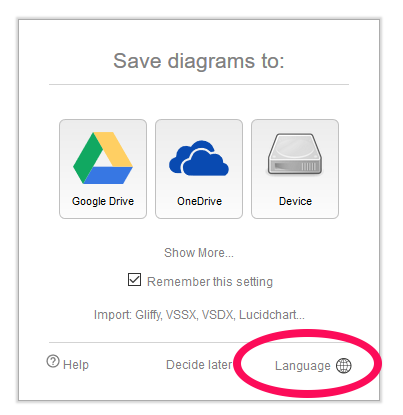

2. Im Normalfall ist die Seite auf Englisch. Klicke im Startfenster auf *Language* und wähle die gewünschte Sprache aus.

3. Bestätige mit *ok*

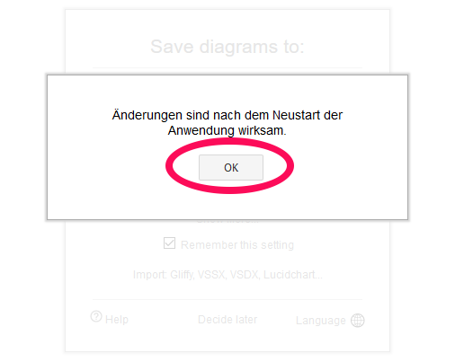

4. Beim nächsten Start der Internetseite wird das Programm in der gewünschten Sprache angezeigt. Möchtest Du die Sprache gleich ändern, muss der Browser aktualisiert werden (Windows F5 Taste / Macintosh CMD+R Tastenkombination drücken)

5. Klicke nun im Fenster *Diagramme speichern in* auf `Gerät`. Damit hast du später die Möglichkeit die Mindmap auf dem PC oder Tablet zu speichern.

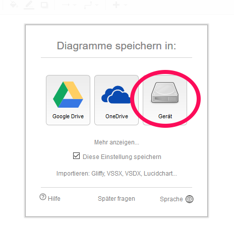

6. Klicke auf *Neues Diagramm erstellen*

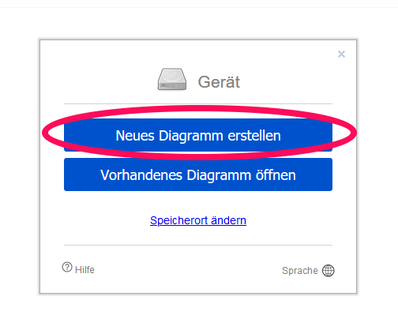

7. Du erhälts eine Übersicht an Vorlagen. In dieser Anleitung beginnen wir mit einem **leeren Diagram** Klicke nun auf den Reiter *(1) Einfach* und auf *(2) Leeres Diagramm* und bestätige mit dem Knopf *(3) Erstellen.*

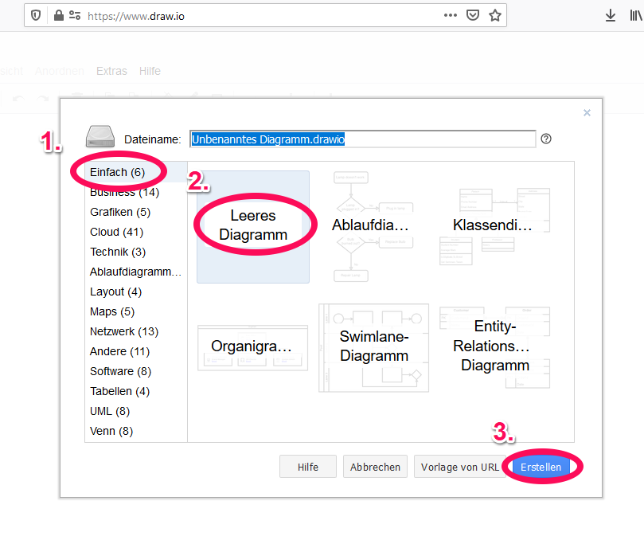

### Mindmap digital erstellen

In diesem Abschnitt verschaffen wir uns einen Überblick über das Programm und lernen die Grundtechniken im Umgang mit Mindmaps.

**Dokumenttitel einrichten**

1. Klicke zu Beginn auf den *(1) Dokumententitel*, damit das Dokument einen aussagekräftigen Namen erhält.
2. Trage im *(2) Eingabefeld* den Namen der Mindmap ein.
3. Bestätige den Namen mit *(3) Umbenennen*

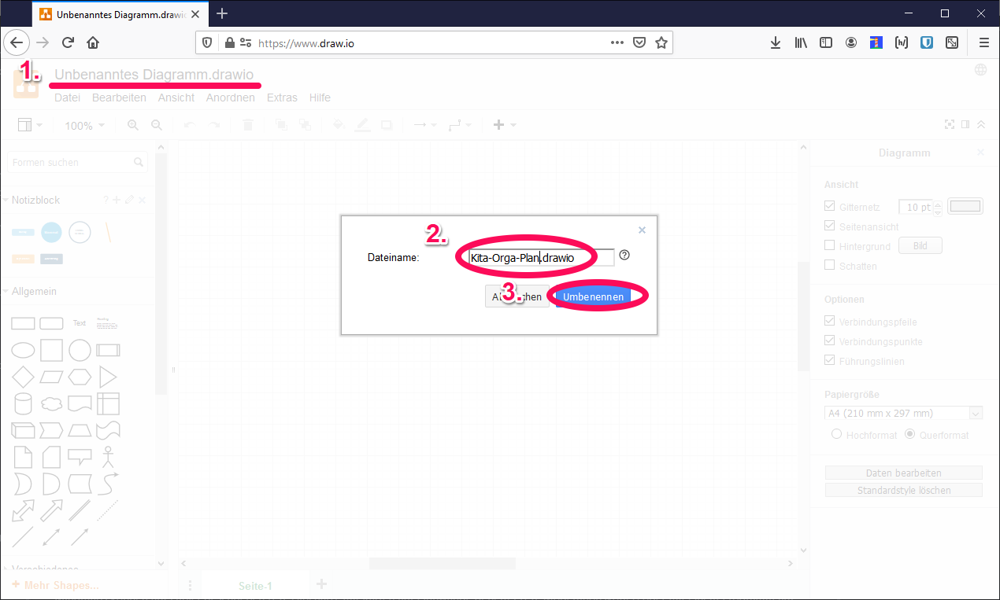

**Bedienfelder kennenlernen**

Das Programm ist in fünf Bereiche aufgeteilt *(1) Menü*, *(2) Werkzeugleiste*, *(3) Arbeitsfläche*, *(4 Informationsbereich)* und der *(5 Fußleiste)*.

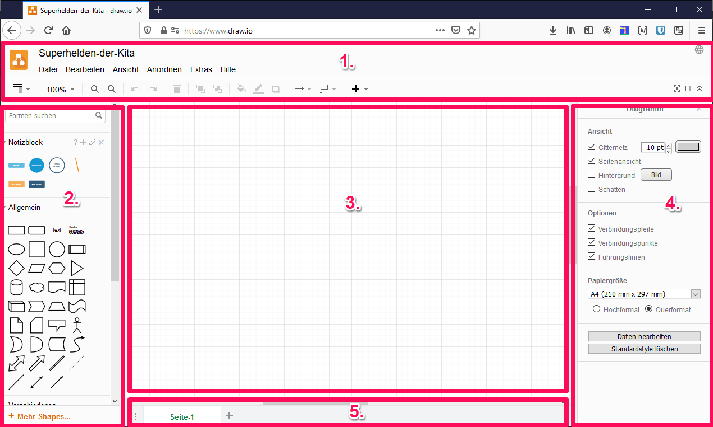

Das Herz einer Mindmap ist der sog. Hauptknotenpunkt oder bei größeren Themenbereichen mehrere Hauptpunkte. Ein Hauptpunkt erkennt man meistens an der größeren Fläche gegenüber den untergeordneten Knotenpunken und oftmals an einer auffälligen Darstellungsweise (Farbe, Schraffur, Kontur, o.ä.). Am Beispiel von Superhelden wäre der Hauptpunkt Superhelden und Knotenpunkte z.B. Wonder Women, Spiderman, Batman, Superman, usw. Ein Beispiel für mehrere Hauptpunkte wäre z.B., wenn auf der linken Seite der Mindmap alle Superhelden und auf der rechten Seite gegenüberliegend alle Bösewichte aufgelistet werden. An diesen Beispielen wird nun die erste Mindmap erstellt.

**Schritt 1: Hauptknotenpunkt erstellen**
Klickt in der Werkzeugleiste das Kreissymbol an, haltet am Computer die linke Maustaste/Touchpad gedrückt oder am Tablet den Finger auf dem Kreissymbol und zieht dieses auf die Arbeitsfläche.

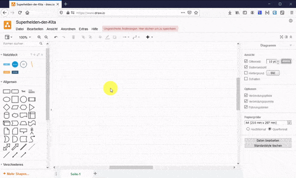

**Schritt 2: Schriftgröße anpassen**
Mit einem Doppelklick auf das Kreissymbol kann eine Beschriftung angelegt werden. In diesem Fall wird der Hauptknotenpunkt mit *Superhelden* beschriftet. Die Schriftgröße kann jederzeit angepasst werden. Klickt hierzu doppelt auf die Schrift oder markiert den Textbereich und wählt im Menü die eine größere oder kleinere Schriftgröße (voreingestellt 12pt) aus. Sollte die Schrift über den Kreis hinausgehen oder viel zu viel Platz haben, kann an den blauen Anfassern, die Größe der Fläche geändert werden.

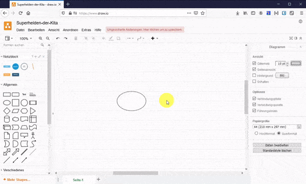

**Schritt 3: Farben auswählen**
Die Farben der einzelnen Flächen und Schriften kann in der rechten Informationsleisten angepasst werden. Wähle dazu einen gewünschten Knotenpunkt aus und klicke auf eine Farbvorlage. Die Farben und Rahmen des Knotenpunkts werden dementsprechend angepasst. Unterhalb der Farbvorlagen kann noch separat die Strichstärke verändert werden.

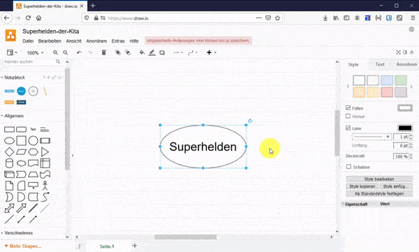

**Schritt 4: Knotenpunkt erstellen und verknüpfen**
Wählt nun eine neue Form aus der Werkzeugleiste aus und zieht diese in die Nähe des Hauptknotenpunkts. Es erscheint an jeder Seite ein kleiner blauer Pfeil. Geht mit der neuen Form darüber. Es erscheint der Hinweis *verbinden*. Lasst die Maustaste oder den Finger los. Die neue Form wurde mit dem Hauptknotenpunkt verbunden.

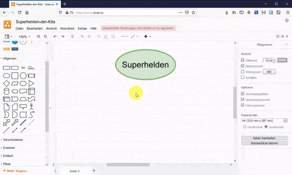

**Schritt 5: Gleiche Unterpunkte erstellen**
Weitere Unterpunkte können mit der Funktionen *Duplizieren* einfach erstellt werden. Klickt dazu mit der linken Maustaste oder dem Finger auf einen Knoten. Drückt die rechte Maustaste oder haltet den Finger längere Zeit auf dem Rahmen der Fläche. Wählt dann im Kontextmenü den Eintrag *Duplizieren*. Klickt den Rahmen der neuen Form an und verschiebt bei gedrückter Maustaste oder dem Finger den Knoten. Damit eine Verbindung erstellt werden kann, muss der Rahmen der Fläche angeklickt und bei gedrückter Maustaste der blaue Pfeil an die gewünschte Stelle geschoben werden.

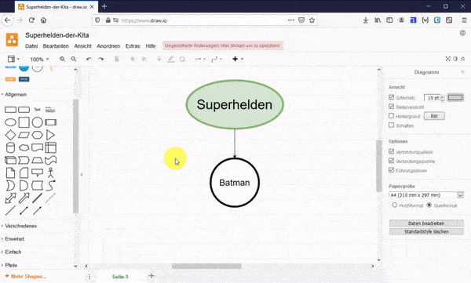

### Speichern, Laden und exportieren

Im letzten Kapitel geht es darum, das Projekt zu speichern, damit es später ggf. wieder geöffnet und weitergeführt werden kann. Das ist z.B. wichtig falls sich ein Schreibfehler eingeschlichen hat oder die Mindmap ergänzt werden soll. Ein solches Format wird als Projektdatei bezeichnet. Projektdateien eignen sich nicht für die Arbeit mit anderen Programmen oder dem Internet. Hierfür benötigen wir ein Bild. In den folgenden Schritten erlernst du diese Handlungsweisen.

**Schritt 1: Projektdatei speichern**

1. Klickt im Menü auf *Datei > Speichern unter ...* und speichere mit dem Knopf *herunterladen*
2. Bestätigt im Browser den Download mit *Datei speichern*

**Schritt 2: Bilddatei exportieren**

1. Klickt erneut ins Menü auf *Datei > Exportieren als > PNG*
2. Behaltet die Grundeinstellungen in diesem Fenster unverändert bei und klickt auf den Knopf *Exportieren*
3. Es erscheint nun die Speicherort Einstellung, dort klickt auf *Herunterladen*
4. Bestätigt im Browser den Download mit *Datei speichern*

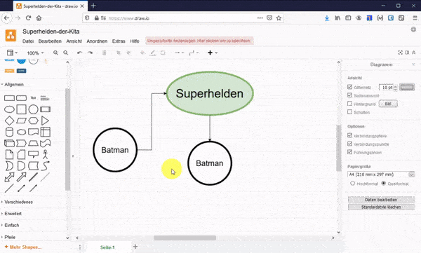

**Schritt 3: Projekt fortfahren**

1. Klickt im Menü auf *Datei > Öffnen von ... > Gerät*
2. Wählt in diesem Fenster die gespeicherte Projektdatei aus und bestätigt mit dem Knopf *Öffnen*

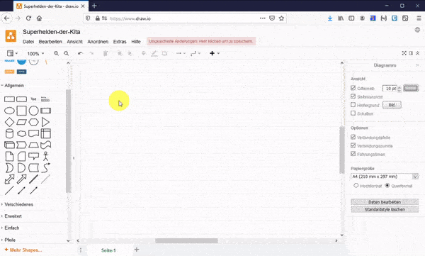

## Und was geht noch damit?

*Diese Technik findet in vielen unterschiedlichen Bereichen Anwendung:*

- Ideensammlung und Brainstorming
- Informationsübersicht
- Planung und Organisation
- Übersicht von komplexe Themen
- Vortrag entwerfen
- Protokoll
- Lernen, Prüfungsvorbereitung
- Sachtexte strukturieren

### weiterführende Informationen

Wer noch etwas effektiver mit dem Programm arbeiten möchte, kann anstelle von vielen Mausklicks auch sog. Tastaturkürzel (engl. shortcuts) verwenden. Draw.io hat für Windows und Macintosh jeweils eine Seite mit den wichtigesten Tastaturbefehlen als Druckvorlage zusammengestellt.

- [DIN A4 Liste Tastaturbefehle Draw.io Windows PDF](tastaturbefehle-shortcuts-drawio-win.pdf)
- [DIN A4 Liste Tastaturbefehle Draw.io Macintosh PDF](tastaturbefehle-shortcuts-drawio-mac.pdf)

### Lizenzhinweis

Du darfst diese Anleitung jederzeit kopieren, für deine Zwecke abändern und z.B. auf deine Internetseite stellen, vollständig aber auch teilweise in eine Präsentation übernehmen wie auch ausdrucken und verteilen. Du musst aber nennen woher du das Material hast. Wir haben dir einen Lizenzhinweis erstellt, übernehme diesen bitte auf deinem Medienprodukt in schriftlicher Form:

 <a href="https://www.zmf.bayern.de/infothek/xxx" rel="cc:attributionURL">Eine Mindmap erstellen</a> von <em><a href="https://www.zmf.bayern.de/infothek/xxx" target="_blank">ZMF</a></em> ist lizenziert unter einer <a href="http://creativecommons.org/licenses/by/4.0/" target="_blank" rel="license">CC BY 4.0 International Lizenz</a>.

---

Vielen Dank für's Zitieren! Damit hilfst du Anderen, dieses Werk zu finden und zugleich trägst dazu bei, freie Bildungsmaterialien für die Gesellschaft zugänglicher zu machen. Wir nennen das, die Kultur des Teilens.

### Anbieterneutralität

Die Anleitung und Vorstellung von Apps und Produkten stellt keine Empfehlung hinsichtlich bestimmter Anbieter dar. Die datenschutzrechtliche Prüfung hinsichtlich der Einsatzmöglichkeiten bzw. hinsichtlich einer Freigabe hat durch den örtlichen Datenschutzbeauftragten zu erfolgen.
