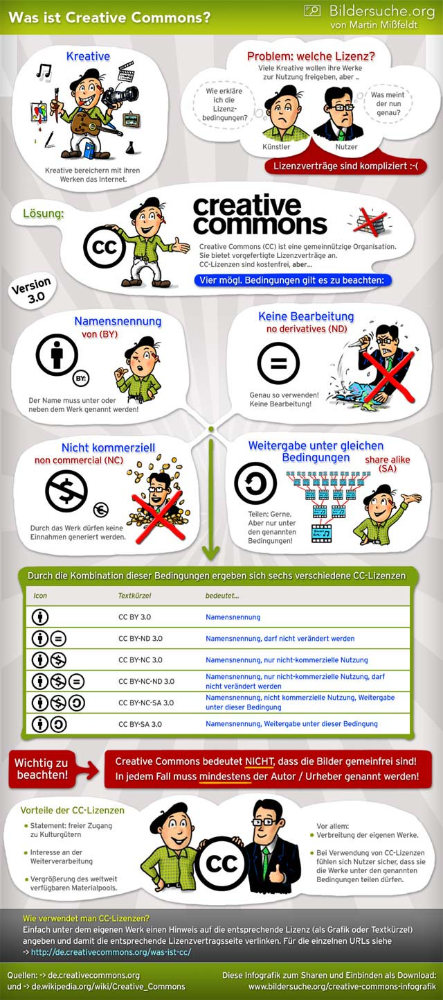

<!-- # Creative Commons - die Kultur des Teilens

 -->

Eine Grußkarte mit einem Bild aus dem Netz gestalten, einen eigenen Film mit einem fremden Song vertonen oder einen Podcast auf der Website veröffentlichen. Das Internet bietet eine nahezu unendliche  Fundgrube an fremden Bildern, Texten und Musikstücken. Etwas zu veröffentlichen, geht schnell, doch wer fremde Inhalte nutzen möchte, sollte einiges beachten.

## Das Urheberrecht schützt kreative Werke

Kreative Werke sind urheberrechtlich geschützt. Dazu gehören:

+ Gezeichnete Bilder
+ Fotografie / Film
+ Musik (auch nur kurze Jingle)
+ Buch
+ Gedicht
+ Tanz

Das heißt, niemand darf zum Beispiel einfach so ein Foto kopieren, verändern oder weiterveröffentlichen, ohne die Fotografin oder den Fotografen zu fragen. Er ist der Urheber und darf entscheiden, was mit seinem Werk passiert. Ziel ist es dabei, dass der Urheber, der Schöpfer des Werks, eine angemessene Vergütung erlangt und über die Verwertung, z.B. Verbreitung, Vervielfältigung etc. bestimmen kann.

## Creative Commons

Der Urheber kann selbst entscheiden, ob er seine Werke unter bestimmten Voraussetzungen anderen zur Verfügung stellt, ohne dass sie ausdrücklich um Erlaubnis fragen müssen, indem er sie mit einer so genannten Creative Commons-Lizenz lizensiert.

Hört sich kompliziert  an, ist es aber nicht: Sind Werke unter diesen Lizenzen veröffentlicht,  bedeutet das, dass man sie auch auf anderen Webseiten oder sogar in  gedruckten Flyern oder ähnlichem verwenden darf. Allerdings können die  Rechteinhaber Bedingungen festlegen, zum Beispiel, dass sie nicht  verändert oder für kommerzielle Zwecke genutzt werden dürfen.  Diese Bedingungen können wie ein Bauskastensystem kombiniert werden.

---

**[Creative Commons - Was ist und bedeutet das?](https://www.bildersuche.org/creative-commons-infografik.php)**  Martin Mißfeldt, [CC BY-SA](https://creativecommons.org/licenses/by-sa/3.0/de/)

## Creative Commons im Überblick

Die Informationsplattform [iRights.info](https://irights.info/) gibt eine kurze Einführung in die verschiedenen Creative Commons-Lizenzen: Es gibt nicht eine einzige  Creative-Commons-Lizenz, sondern verschiedene, die sich Nutzerinnen und Nutzer aus einem Lizenzbaukasten selbst zusammenstellen können. Zur  Auswahl stehen folgende Lizenzen:

- <svg xmlns="http://www.w3.org/2000/svg" viewBox="0 0 19 19" width="19px" height="19px"><defs/><path fill="#fff" d="M17.934 9.59a8.394 8.394 0 01-8.395 8.394A8.396 8.396 0 011.145 9.59a8.396 8.396 0 018.394-8.395 8.394 8.394 0 018.395 8.395zm0 0"/><path d="M9.484 0c2.668 0 4.918.914 6.75 2.75C18.078 4.59 19 6.844 19 9.5c0 2.668-.906 4.89-2.715 6.668C14.363 18.055 12.094 19 9.485 19c-2.57 0-4.797-.934-6.684-2.8C.934 14.335 0 12.101 0 9.5c0-2.602.934-4.852 2.8-6.75C4.634.914 6.86 0 9.485 0zm.032 1.715c-2.16 0-3.985.758-5.477 2.273C2.49 5.57 1.715 7.41 1.715 9.5c0 2.105.765 3.926 2.305 5.46 1.539 1.54 3.37 2.31 5.496 2.31 2.117 0 3.96-.774 5.53-2.325 1.493-1.437 2.24-3.25 2.24-5.445 0-2.16-.759-3.996-2.274-5.512-1.516-1.515-3.348-2.273-5.496-2.273zm2.546 5.426v3.886h-1.085v4.614H8.023v-4.614H6.938V7.141a.59.59 0 01.18-.43.578.578 0 01.433-.18h3.902a.59.59 0 01.422.18.568.568 0 01.188.43zM8.177 4.699c0-.894.441-1.34 1.324-1.34s1.324.446 1.324 1.34c0 .883-.441 1.324-1.324 1.324S8.176 5.582 8.176 4.7zm0 0"/></svg> **Namensnennung:** Der Name des Urhebers muss genannt werden. Diese Bedingung ist  seit der Version 2.0 der CC-Lizenzen nicht mehr wählbar, sondern wird  automatisch ausgewählt.
- <svg xmlns="http://www.w3.org/2000/svg" viewBox="0 0 19 19" width="19px" height="19px"><defs/><path fill="#fff" d="M17.934 9.59a8.394 8.394 0 01-8.395 8.394A8.396 8.396 0 011.145 9.59a8.396 8.396 0 018.394-8.395 8.394 8.394 0 018.395 8.395zm0 0"/><path d="M9.484 0c2.668 0 4.918.914 6.75 2.75C18.078 4.59 19 6.844 19 9.5c0 2.668-.906 4.89-2.715 6.668C14.363 18.055 12.094 19 9.485 19c-2.57 0-4.797-.934-6.684-2.8C.934 14.335 0 12.101 0 9.5c0-2.602.934-4.852 2.8-6.75C4.634.914 6.86 0 9.485 0zm.032 1.715c-2.16 0-3.985.758-5.477 2.273C2.49 5.57 1.715 7.41 1.715 9.5c0 2.105.765 3.926 2.305 5.46 1.539 1.54 3.37 2.31 5.496 2.31 2.117 0 3.96-.774 5.53-2.325 1.493-1.437 2.24-3.25 2.24-5.445 0-2.16-.759-3.996-2.274-5.512-1.516-1.515-3.348-2.273-5.496-2.273zm2.546 5.426v3.886h-1.085v4.614H8.023v-4.614H6.938V7.141a.59.59 0 01.18-.43.578.578 0 01.433-.18h3.902a.59.59 0 01.422.18.568.568 0 01.188.43zM8.177 4.699c0-.894.441-1.34 1.324-1.34s1.324.446 1.324 1.34c0 .883-.441 1.324-1.324 1.324S8.176 5.582 8.176 4.7zm0 0"/></svg> <svg xmlns="http://www.w3.org/2000/svg" viewBox="0 0 19 19" width="19px" height="19px"><defs/><path fill="#fff" d="M18.133 9.438A8.612 8.612 0 019.52 18.05 8.612 8.612 0 01.906 9.438 8.612 8.612 0 019.52.823a8.612 8.612 0 018.613 8.614zm0 0"/><path d="M9.484 0c2.657 0 4.907.922 6.75 2.766C18.078 4.598 19 6.84 19 9.5s-.906 4.887-2.715 6.684c-1.91 1.878-4.18 2.816-6.8 2.816-2.57 0-4.797-.934-6.684-2.8C.934 14.335 0 12.101 0 9.5c0-2.59.934-4.836 2.8-6.734C4.646.922 6.872 0 9.485 0zm.036 1.715c-2.16 0-3.989.762-5.48 2.289C2.487 5.578 1.714 7.41 1.714 9.5c0 2.117.77 3.938 2.305 5.46 1.539 1.54 3.37 2.31 5.496 2.31 2.117 0 3.96-.774 5.53-2.325 1.493-1.449 2.24-3.261 2.24-5.445 0-2.172-.759-4.004-2.274-5.496-1.504-1.527-3.336-2.29-5.492-2.29zm3.578 5.547V8.89H6.19V7.26zm0 3.05v1.63H6.19v-1.63zm0 0"/></svg> **Namensnennung-KeineBearbeitung:** Der Name des Urhebers muss genannt werden, das Werk darf nicht verändert werden.
- <svg xmlns="http://www.w3.org/2000/svg" viewBox="0 0 19 19" width="19px" height="19px"><defs/><path fill="#fff" d="M17.934 9.59a8.394 8.394 0 01-8.395 8.394A8.396 8.396 0 011.145 9.59a8.396 8.396 0 018.394-8.395 8.394 8.394 0 018.395 8.395zm0 0"/><path d="M9.484 0c2.668 0 4.918.914 6.75 2.75C18.078 4.59 19 6.844 19 9.5c0 2.668-.906 4.89-2.715 6.668C14.363 18.055 12.094 19 9.485 19c-2.57 0-4.797-.934-6.684-2.8C.934 14.335 0 12.101 0 9.5c0-2.602.934-4.852 2.8-6.75C4.634.914 6.86 0 9.485 0zm.032 1.715c-2.16 0-3.985.758-5.477 2.273C2.49 5.57 1.715 7.41 1.715 9.5c0 2.105.765 3.926 2.305 5.46 1.539 1.54 3.37 2.31 5.496 2.31 2.117 0 3.96-.774 5.53-2.325 1.493-1.437 2.24-3.25 2.24-5.445 0-2.16-.759-3.996-2.274-5.512-1.516-1.515-3.348-2.273-5.496-2.273zm2.546 5.426v3.886h-1.085v4.614H8.023v-4.614H6.938V7.141a.59.59 0 01.18-.43.578.578 0 01.433-.18h3.902a.59.59 0 01.422.18.568.568 0 01.188.43zM8.177 4.699c0-.894.441-1.34 1.324-1.34s1.324.446 1.324 1.34c0 .883-.441 1.324-1.324 1.324S8.176 5.582 8.176 4.7zm0 0"/></svg> <svg xmlns="http://www.w3.org/2000/svg" viewBox="0 0 19 19" width="19px" height="19px"><defs/><path fill="#fff" d="M17.906 9.473a8.58 8.58 0 01-8.578 8.578A8.58 8.58 0 01.75 9.473 8.577 8.577 0 019.328.895a8.577 8.577 0 018.578 8.578zm0 0"/><path d="M16.242 2.754C14.402.918 12.152 0 9.488 0c-2.633 0-4.86.918-6.683 2.754C.934 4.656 0 6.902 0 9.5c0 2.598.934 4.828 2.805 6.695C4.675 18.066 6.902 19 9.488 19c2.614 0 4.883-.941 6.801-2.828C18.098 14.382 19 12.16 19 9.5s-.922-4.91-2.758-6.746zm-1.191 12.183c-1.57 1.551-3.414 2.329-5.54 2.329-2.124 0-3.956-.77-5.491-2.305-1.54-1.535-2.31-3.356-2.31-5.461 0-.89.142-1.734.419-2.527l2.52 1.113h-.184v1.129h.89c0 .16-.015.32-.015.48v.27h-.875v1.129H5.5c.145.844.46 1.527.89 2.066.891 1.18 2.32 1.813 3.88 1.813 1.02 0 1.94-.301 2.48-.602l-.379-1.766c-.336.176-1.082.415-1.812.415-.797 0-1.543-.239-2.055-.813-.238-.27-.41-.637-.524-1.113h3.457l4.915 2.176a7.294 7.294 0 01-1.301 1.668zM8.87 9.965l-.02-.016.036.016zm2.961-.75h.14v-1.13h-2.69l-1.095-.48c.094-.214.204-.402.336-.55.493-.606 1.192-.86 1.954-.86.703 0 1.351.207 1.765.383l.445-1.816c-.57-.254-1.414-.477-2.382-.477-1.496 0-2.77.606-3.676 1.625-.2.23-.375.492-.535.766l-3.121-1.38c.3-.456.656-.89 1.07-1.308 1.488-1.52 3.312-2.277 5.469-2.277 2.156 0 3.988.758 5.492 2.277 1.523 1.504 2.281 3.34 2.281 5.512 0 .715-.078 1.39-.238 2.023zm0 0"/></svg> **Namensnennung-NichtKommerziell:** Der Name des Urhebers muss genannt werden, das Werk darf nicht zu gewerblichen Zwecken verwendet werden.

> Tipp:  Der Zusatz *NichKommerziell* erweist sich in der Praxis oftmals als etwas schwierig. Es ist nämlich oft schwer erkennbar ob und inwiefern es sich um einen kommerziellen Hintergrund handelt. Es geht nicht nur darum, ob direkt Geld mit dem Werk verdient wird. Wenn eure Einrichtung zum Beispiel bei einem privaten Träger angesiedelt ist, handelt es sich schon um gewerbliche Zwecke.

- <svg xmlns="http://www.w3.org/2000/svg" viewBox="0 0 19 19" width="19px" height="19px"><defs/><path fill="#fff" d="M17.934 9.59a8.394 8.394 0 01-8.395 8.394A8.396 8.396 0 011.145 9.59a8.396 8.396 0 018.394-8.395 8.394 8.394 0 018.395 8.395zm0 0"/><path d="M9.484 0c2.668 0 4.918.914 6.75 2.75C18.078 4.59 19 6.844 19 9.5c0 2.668-.906 4.89-2.715 6.668C14.363 18.055 12.094 19 9.485 19c-2.57 0-4.797-.934-6.684-2.8C.934 14.335 0 12.101 0 9.5c0-2.602.934-4.852 2.8-6.75C4.634.914 6.86 0 9.485 0zm.032 1.715c-2.16 0-3.985.758-5.477 2.273C2.49 5.57 1.715 7.41 1.715 9.5c0 2.105.765 3.926 2.305 5.46 1.539 1.54 3.37 2.31 5.496 2.31 2.117 0 3.96-.774 5.53-2.325 1.493-1.437 2.24-3.25 2.24-5.445 0-2.16-.759-3.996-2.274-5.512-1.516-1.515-3.348-2.273-5.496-2.273zm2.546 5.426v3.886h-1.085v4.614H8.023v-4.614H6.938V7.141a.59.59 0 01.18-.43.578.578 0 01.433-.18h3.902a.59.59 0 01.422.18.568.568 0 01.188.43zM8.177 4.699c0-.894.441-1.34 1.324-1.34s1.324.446 1.324 1.34c0 .883-.441 1.324-1.324 1.324S8.176 5.582 8.176 4.7zm0 0"/></svg> <svg xmlns="http://www.w3.org/2000/svg" viewBox="0 0 19 19" width="19px" height="19px"><defs/><path fill="#fff" d="M17.906 9.473a8.58 8.58 0 01-8.578 8.578A8.58 8.58 0 01.75 9.473 8.577 8.577 0 019.328.895a8.577 8.577 0 018.578 8.578zm0 0"/><path d="M16.242 2.754C14.402.918 12.152 0 9.488 0c-2.633 0-4.86.918-6.683 2.754C.934 4.656 0 6.902 0 9.5c0 2.598.934 4.828 2.805 6.695C4.675 18.066 6.902 19 9.488 19c2.614 0 4.883-.941 6.801-2.828C18.098 14.382 19 12.16 19 9.5s-.922-4.91-2.758-6.746zm-1.191 12.183c-1.57 1.551-3.414 2.329-5.54 2.329-2.124 0-3.956-.77-5.491-2.305-1.54-1.535-2.31-3.356-2.31-5.461 0-.89.142-1.734.419-2.527l2.52 1.113h-.184v1.129h.89c0 .16-.015.32-.015.48v.27h-.875v1.129H5.5c.145.844.46 1.527.89 2.066.891 1.18 2.32 1.813 3.88 1.813 1.02 0 1.94-.301 2.48-.602l-.379-1.766c-.336.176-1.082.415-1.812.415-.797 0-1.543-.239-2.055-.813-.238-.27-.41-.637-.524-1.113h3.457l4.915 2.176a7.294 7.294 0 01-1.301 1.668zM8.87 9.965l-.02-.016.036.016zm2.961-.75h.14v-1.13h-2.69l-1.095-.48c.094-.214.204-.402.336-.55.493-.606 1.192-.86 1.954-.86.703 0 1.351.207 1.765.383l.445-1.816c-.57-.254-1.414-.477-2.382-.477-1.496 0-2.77.606-3.676 1.625-.2.23-.375.492-.535.766l-3.121-1.38c.3-.456.656-.89 1.07-1.308 1.488-1.52 3.312-2.277 5.469-2.277 2.156 0 3.988.758 5.492 2.277 1.523 1.504 2.281 3.34 2.281 5.512 0 .715-.078 1.39-.238 2.023zm0 0"/></svg> <svg xmlns="http://www.w3.org/2000/svg" viewBox="0 0 19 19" width="19px" height="19px"><defs/><path fill="#fff" d="M18.133 9.438A8.612 8.612 0 019.52 18.05 8.612 8.612 0 01.906 9.438 8.612 8.612 0 019.52.823a8.612 8.612 0 018.613 8.614zm0 0"/><path d="M9.484 0c2.657 0 4.907.922 6.75 2.766C18.078 4.598 19 6.84 19 9.5s-.906 4.887-2.715 6.684c-1.91 1.878-4.18 2.816-6.8 2.816-2.57 0-4.797-.934-6.684-2.8C.934 14.335 0 12.101 0 9.5c0-2.59.934-4.836 2.8-6.734C4.646.922 6.872 0 9.485 0zm.036 1.715c-2.16 0-3.989.762-5.48 2.289C2.487 5.578 1.714 7.41 1.714 9.5c0 2.117.77 3.938 2.305 5.46 1.539 1.54 3.37 2.31 5.496 2.31 2.117 0 3.96-.774 5.53-2.325 1.493-1.449 2.24-3.261 2.24-5.445 0-2.172-.759-4.004-2.274-5.496-1.504-1.527-3.336-2.29-5.492-2.29zm3.578 5.547V8.89H6.19V7.26zm0 3.05v1.63H6.19v-1.63zm0 0"/></svg> **Namensnennung-NichtKommerziell-KeineBearbeitung:** Der Name des Urhebers muss genannt werden, das Werk darf nicht zu  gewerblichen Zwecken verwendet werden, das Werk darf nicht verändert  werden.
- <svg xmlns="http://www.w3.org/2000/svg" viewBox="0 0 19 19" width="19px" height="19px"><defs/><path fill="#fff" d="M17.934 9.59a8.394 8.394 0 01-8.395 8.394A8.396 8.396 0 011.145 9.59a8.396 8.396 0 018.394-8.395 8.394 8.394 0 018.395 8.395zm0 0"/><path d="M9.484 0c2.668 0 4.918.914 6.75 2.75C18.078 4.59 19 6.844 19 9.5c0 2.668-.906 4.89-2.715 6.668C14.363 18.055 12.094 19 9.485 19c-2.57 0-4.797-.934-6.684-2.8C.934 14.335 0 12.101 0 9.5c0-2.602.934-4.852 2.8-6.75C4.634.914 6.86 0 9.485 0zm.032 1.715c-2.16 0-3.985.758-5.477 2.273C2.49 5.57 1.715 7.41 1.715 9.5c0 2.105.765 3.926 2.305 5.46 1.539 1.54 3.37 2.31 5.496 2.31 2.117 0 3.96-.774 5.53-2.325 1.493-1.437 2.24-3.25 2.24-5.445 0-2.16-.759-3.996-2.274-5.512-1.516-1.515-3.348-2.273-5.496-2.273zm2.546 5.426v3.886h-1.085v4.614H8.023v-4.614H6.938V7.141a.59.59 0 01.18-.43.578.578 0 01.433-.18h3.902a.59.59 0 01.422.18.568.568 0 01.188.43zM8.177 4.699c0-.894.441-1.34 1.324-1.34s1.324.446 1.324 1.34c0 .883-.441 1.324-1.324 1.324S8.176 5.582 8.176 4.7zm0 0"/></svg> <svg xmlns="http://www.w3.org/2000/svg" viewBox="0 0 19 19" width="19px" height="19px"><defs/><path fill="#fff" d="M17.906 9.473a8.58 8.58 0 01-8.578 8.578A8.58 8.58 0 01.75 9.473 8.577 8.577 0 019.328.895a8.577 8.577 0 018.578 8.578zm0 0"/><path d="M16.242 2.754C14.402.918 12.152 0 9.488 0c-2.633 0-4.86.918-6.683 2.754C.934 4.656 0 6.902 0 9.5c0 2.598.934 4.828 2.805 6.695C4.675 18.066 6.902 19 9.488 19c2.614 0 4.883-.941 6.801-2.828C18.098 14.382 19 12.16 19 9.5s-.922-4.91-2.758-6.746zm-1.191 12.183c-1.57 1.551-3.414 2.329-5.54 2.329-2.124 0-3.956-.77-5.491-2.305-1.54-1.535-2.31-3.356-2.31-5.461 0-.89.142-1.734.419-2.527l2.52 1.113h-.184v1.129h.89c0 .16-.015.32-.015.48v.27h-.875v1.129H5.5c.145.844.46 1.527.89 2.066.891 1.18 2.32 1.813 3.88 1.813 1.02 0 1.94-.301 2.48-.602l-.379-1.766c-.336.176-1.082.415-1.812.415-.797 0-1.543-.239-2.055-.813-.238-.27-.41-.637-.524-1.113h3.457l4.915 2.176a7.294 7.294 0 01-1.301 1.668zM8.87 9.965l-.02-.016.036.016zm2.961-.75h.14v-1.13h-2.69l-1.095-.48c.094-.214.204-.402.336-.55.493-.606 1.192-.86 1.954-.86.703 0 1.351.207 1.765.383l.445-1.816c-.57-.254-1.414-.477-2.382-.477-1.496 0-2.77.606-3.676 1.625-.2.23-.375.492-.535.766l-3.121-1.38c.3-.456.656-.89 1.07-1.308 1.488-1.52 3.312-2.277 5.469-2.277 2.156 0 3.988.758 5.492 2.277 1.523 1.504 2.281 3.34 2.281 5.512 0 .715-.078 1.39-.238 2.023zm0 0"/></svg> <svg xmlns="http://www.w3.org/2000/svg" viewBox="0 0 19 19" width="19px" height="19px"><defs/><path fill="#fff" d="M17.976562 9.539062c0 4.773438-3.871093 8.640626-8.640624 8.640626-4.773438 0-8.640626-3.867188-8.640626-8.640626 0-4.773437 3.867188-8.640624 8.640626-8.640624 4.769531 0 8.640624 3.867187 8.640624 8.640624zm0 0"/><path d="M9.484375 0c2.65625 0 4.90625.921875 6.75 2.765625C18.078125 4.597656 19 6.84375 19 9.5c0 2.660156-.90625 4.886719-2.714844 6.683594C14.375 18.0625 12.105469 19 9.484375 19c-2.570313 0-4.796875-.933594-6.683594-2.800781C.933594 14.335938 0 12.101562 0 9.5c0-2.589844.933594-4.835938 2.800781-6.734375C4.640625.921875 6.871094 0 9.484375 0zm.03125 1.714844c-2.160156 0-3.984375.761718-5.476563 2.289062C2.488281 5.578125 1.714844 7.410156 1.714844 9.5c0 2.117188.765625 3.9375 2.304687 5.460938C5.558594 16.5 7.390625 17.269531 9.515625 17.269531c2.117187 0 3.960937-.773437 5.53125-2.324219 1.492187-1.449218 2.238281-3.261718 2.238281-5.445312 0-2.171875-.757812-4.003906-2.273437-5.496094-1.503907-1.527344-3.335938-2.289062-5.496094-2.289062zM5.277344 8.160156c.179687-1.164062.648437-2.066406 1.40625-2.707031.757812-.636719 1.679687-.957031 2.765625-.957031 1.492187 0 2.679687.480468 3.5625 1.441406.882812.960938 1.324219 2.195312 1.324219 3.699219 0 1.457031-.460938 2.671875-1.375 3.636719-.917969.96875-2.105469 1.449218-3.5625 1.449218-1.074219 0-2.003907-.320312-2.78125-.964844-.78125-.644531-1.25-1.5625-1.410157-2.75h2.394531c.054688 1.15625.75 1.730469 2.085938 1.730469.667969 0 1.203125-.285156 1.609375-.863281.410156-.578125.613281-1.347656.613281-2.308594 0-1.003906-.1875-1.769531-.558594-2.296875-.375-.527343-.910156-.789062-1.613281-.789062-1.265625 0-1.980469.558593-2.136719 1.679687h.695313l-1.882813 1.882813L4.53125 8.160156zm0 0"/></svg> **Namensnennung-NichtKommerziell-Weitergabe unter gleichen Bedingungen:** Der Name des Urhebers muss genannt werden, das Werk darf nicht zu  gewerblichen Zwecken verwendet werden; wird eine neu entstandene Version weitergegeben, müssen die gleichen Bedingungen gelten – es muss also  wieder erlaubt sein, sie zu verändern.
- <svg xmlns="http://www.w3.org/2000/svg" viewBox="0 0 19 19" width="19px" height="19px"><defs/><path fill="#fff" d="M17.934 9.59a8.394 8.394 0 01-8.395 8.394A8.396 8.396 0 011.145 9.59a8.396 8.396 0 018.394-8.395 8.394 8.394 0 018.395 8.395zm0 0"/><path d="M9.484 0c2.668 0 4.918.914 6.75 2.75C18.078 4.59 19 6.844 19 9.5c0 2.668-.906 4.89-2.715 6.668C14.363 18.055 12.094 19 9.485 19c-2.57 0-4.797-.934-6.684-2.8C.934 14.335 0 12.101 0 9.5c0-2.602.934-4.852 2.8-6.75C4.634.914 6.86 0 9.485 0zm.032 1.715c-2.16 0-3.985.758-5.477 2.273C2.49 5.57 1.715 7.41 1.715 9.5c0 2.105.765 3.926 2.305 5.46 1.539 1.54 3.37 2.31 5.496 2.31 2.117 0 3.96-.774 5.53-2.325 1.493-1.437 2.24-3.25 2.24-5.445 0-2.16-.759-3.996-2.274-5.512-1.516-1.515-3.348-2.273-5.496-2.273zm2.546 5.426v3.886h-1.085v4.614H8.023v-4.614H6.938V7.141a.59.59 0 01.18-.43.578.578 0 01.433-.18h3.902a.59.59 0 01.422.18.568.568 0 01.188.43zM8.177 4.699c0-.894.441-1.34 1.324-1.34s1.324.446 1.324 1.34c0 .883-.441 1.324-1.324 1.324S8.176 5.582 8.176 4.7zm0 0"/></svg> <svg xmlns="http://www.w3.org/2000/svg" viewBox="0 0 19 19" width="19px" height="19px"><defs/><path fill="#fff" d="M17.976562 9.539062c0 4.773438-3.871093 8.640626-8.640624 8.640626-4.773438 0-8.640626-3.867188-8.640626-8.640626 0-4.773437 3.867188-8.640624 8.640626-8.640624 4.769531 0 8.640624 3.867187 8.640624 8.640624zm0 0"/><path d="M9.484375 0c2.65625 0 4.90625.921875 6.75 2.765625C18.078125 4.597656 19 6.84375 19 9.5c0 2.660156-.90625 4.886719-2.714844 6.683594C14.375 18.0625 12.105469 19 9.484375 19c-2.570313 0-4.796875-.933594-6.683594-2.800781C.933594 14.335938 0 12.101562 0 9.5c0-2.589844.933594-4.835938 2.800781-6.734375C4.640625.921875 6.871094 0 9.484375 0zm.03125 1.714844c-2.160156 0-3.984375.761718-5.476563 2.289062C2.488281 5.578125 1.714844 7.410156 1.714844 9.5c0 2.117188.765625 3.9375 2.304687 5.460938C5.558594 16.5 7.390625 17.269531 9.515625 17.269531c2.117187 0 3.960937-.773437 5.53125-2.324219 1.492187-1.449218 2.238281-3.261718 2.238281-5.445312 0-2.171875-.757812-4.003906-2.273437-5.496094-1.503907-1.527344-3.335938-2.289062-5.496094-2.289062zM5.277344 8.160156c.179687-1.164062.648437-2.066406 1.40625-2.707031.757812-.636719 1.679687-.957031 2.765625-.957031 1.492187 0 2.679687.480468 3.5625 1.441406.882812.960938 1.324219 2.195312 1.324219 3.699219 0 1.457031-.460938 2.671875-1.375 3.636719-.917969.96875-2.105469 1.449218-3.5625 1.449218-1.074219 0-2.003907-.320312-2.78125-.964844-.78125-.644531-1.25-1.5625-1.410157-2.75h2.394531c.054688 1.15625.75 1.730469 2.085938 1.730469.667969 0 1.203125-.285156 1.609375-.863281.410156-.578125.613281-1.347656.613281-2.308594 0-1.003906-.1875-1.769531-.558594-2.296875-.375-.527343-.910156-.789062-1.613281-.789062-1.265625 0-1.980469.558593-2.136719 1.679687h.695313l-1.882813 1.882813L4.53125 8.160156zm0 0"/></svg> **Namensnennung-Weitergabe unter gleichen Bedingungen:** Der Name des Urhebers muss genannt werden; wird eine neu entstandene  Version weitergegeben, müssen die gleichen Bedingungen gelten – es muss  also wieder erlaubt sein, sie zu verändern und kommerziell zu nutzen.

Ein weiteres von Creative Commons entwickeltes Werkzeug ist die  CC-Zero-Widmung (kurz CC0). Inhalte, die damit ausgezeichnet sind,  lassen sich beliebig ohne weitere Auflagen verwenden. Eingesetzt wird  das Werkzeug unter anderem von Museen, die damit klarmachen wollen, dass sie keine Rechte beanspruchen, wenn sie zum Beispiel Fotos von an sich urheberrechtsfreien Kunstwerken veröffentlichen. Hiermit soll auch  verhindert werden, dass sich Dritte als Rechteinhaber von Werken  ausgeben können, deren Urheberrechte abgelaufen sind.

<svg xmlns="http://www.w3.org/2000/svg" viewBox="0 0 19 19" width="19px" height="19px"><defs/><path fill="#fff" d="M18.382812 9.609375c0 4.9375-4 8.9375-8.933593 8.9375-4.9375 0-8.9375-4-8.9375-8.9375 0-4.933594 4-8.933594 8.9375-8.933594 4.933593 0 8.933593 4 8.933593 8.933594zm0 0"/><path d="M9.5 4.03125c-3.136719 0-3.925781 2.960938-3.925781 5.46875S6.363281 14.96875 9.5 14.96875c3.136719 0 3.925781-2.960938 3.925781-5.46875S12.636719 4.03125 9.5 4.03125zm0 2.0625c.128906 0 .242188.019531.351562.046875.226563.195313.335938.464844.121094.835937l-2.089844 3.839844c-.0625-.484375-.074218-.960937-.074218-1.316406 0-1.105469.078125-3.40625 1.691406-3.40625zm1.5625 1.769531c.113281.589844.128906 1.203125.128906 1.636719 0 1.105469-.078125 3.40625-1.691406 3.40625-.125 0-.242188-.011719-.351562-.039062-.019532-.007813-.039063-.015626-.058594-.019532-.035156-.011718-.070313-.019531-.101563-.035156-.359375-.152344-.585937-.429688-.257812-.917969zm0 0"/><path d="M9.480469 0C6.84375 0 4.625.917969 2.8125 2.761719c-.914062.914062-1.613281 1.960937-2.101562 3.125C.238281 7.042969 0 8.246094 0 9.5c0 1.265625.238281 2.46875.710938 3.613281C1.1875 14.253906 1.875 15.28125 2.78125 16.199219c.914062.90625 1.945312 1.601562 3.085938 2.089843C7.019531 18.761719 8.222656 19 9.480469 19c1.253906 0 2.476562-.246094 3.652343-.730469 1.175782-.488281 2.226563-1.1875 3.152344-2.105469.894532-.867187 1.570313-1.867187 2.023438-3C18.769531 12.023438 19 10.800781 19 9.5c0-1.289062-.230469-2.511719-.691406-3.652344-.464844-1.152344-1.144532-2.171875-2.035156-3.066406C14.40625.925781 12.136719 0 9.480469 0zm.039062 1.710938c2.148438 0 3.980469.761718 5.507813 2.289062.734375.734375 1.300781 1.574219 1.683594 2.511719.386718.941406.578124 1.9375.578124 2.988281 0 2.183594-.746093 3.996094-2.226562 5.441406-.769531.746094-1.632812 1.320313-2.59375 1.714844-.953125.398438-1.929688.59375-2.949219.59375-1.027343 0-2.015625-.195312-2.953125-.578125-.9375-.394531-1.78125-.960937-2.527344-1.695313-.746093-.75-1.324218-1.589843-1.730468-2.53125-.394532-.949218-.597656-1.929687-.597656-2.945312 0-1.03125.203124-2.015625.597656-2.953125.40625-.949219.984375-1.804687 1.730468-2.5625C5.519531 2.46875 7.347656 1.710938 9.519531 1.710938zm0 0"/></svg> **Public Domain Dedication:** Das Werk darf ohne weitere Bedingungen zu beliebigen Zwecken  kopiert, verändert, verbreitet oder anderweitig genutzt werden. Der  Rechteinhaber erklärt, dass er auf etwaige Rechte vollständig verzichtet oder eine bedingungslose Lizenz vergibt, falls kein solcher Verzicht im Gesetz vorgesehen ist.

---

**[Fremde Inhalte auf eigenen Seiten](https://irights.info/artikel/fremde-inhalte-auf-eigenen-seiten/5806)** iRIGHTS.info,  [CC BY](https://creativecommons.org/licenses/by/4.0/deed.de) angepasst durch [ZMF](www.zmf.bayern)

> Tipp: In der Praxis haben sich die Lizenzen *Namensnennung* und *Public Domain Dedication* bewährt. So stellt ihr sicher, dass ihr die Werke auch bearbeiten und kommerziell verwenden dürft. Ihr könnt in der erweiterten Suche vieler Suchmaschinen nach bestimmten Lizenzen filtern.

## Fazit

Wenn wir ein paar Grundsätze beachten, können wir auf eine Vielzahl an Materialien aus dem Internet zurückgreifen und für unsere pädagogische Arbeit verwenden. Mit Creative Commons Lizenzen helfen wir außerdem anderen, ihre Werke zu schützen und tragen gleichzeitig dazu bei, freie Materialien für die  Gesellschaft zugänglicher zu machen.

## Zum Weiterlesen

+ Wer sich tiefer in die Verwendung von CC-Lizenzen einlesen will, dem sei die Broschüre von iRIGHTS.info empfohlen: [https://irights.info/wp-content/uploads/2018/10/JOINTLY-BROSCHUERE-OER-richtig-verwenden-Kombinieren-Bearbeiten-Remixen-Auflage-Okt2018.pdf](https://irights.info/wp-content/uploads/2018/10/JOINTLY-BROSCHUERE-OER-richtig-verwenden-Kombinieren-Bearbeiten-Remixen-Auflage-Okt2018.pdf)
+ Mehr Informationen über die Organisation Creative Commons: [https://creativecommons.org/](https://creativecommons.org/licenses/?lang=de)
+ Mit der CC Suchmaschine könnt ihr nach Bildern mit der für euch passenden Lizenz suchen: [https://search.creativecommons.org/](https://search.creativecommons.org/)
+ Beim Medienpädagogik-Praxis Blog findet ihr eine große Liste mit Links zu freier Musik und freien Fotos: [https://www.medienpaedagogik-praxis.de/kostenlose-medien/](https://www.medienpaedagogik-praxis.de/kostenlose-medien/)
+ Weiteren Rechtsfragen im Netz hat sich die EU-Initiative klicksafe zusammen mit iRights.info in einer Beitragsreihe gewidmet: [https://www.klicksafe.de/themen/rechtsfragen-im-netz/irights/](https://www.klicksafe.de/themen/rechtsfragen-im-netz/irights/)

<h2> Lizenzhinweis</h2>

Du darfst diese Anleitung jederzeit kopieren, für deine Zwecke abändern und z.B. auf deine Internetseite stellen, vollständig aber auch teilweise in eine Präsentation übernehmen wie auch ausdrucken und verteilen. Du musst aber nennen woher du das Material hast. Wir haben dir einen Lizenzhinweis erstellt, übernehme diesen bitte auf deinem Medienprodukt in schriftlicher Form.

<aside>  <a href="https://www.zmf.bayern/zmfinfothek/creative-commons-die-kultur-des-teilens/" rel="cc:attributionURL">Creative Commons - die Kultur des Teilens</a> von <a href="https://www.zmf.bayern/infothek/" target="_blank" rel="noopener noreferrer">ZMF</a> ist lizenziert unter einer <a href="http://creativecommons.org/licenses/by/4.0/" target="_blank" rel="license noopener noreferrer">CC BY 4.0 International Lizenz</a>.

Vielen Dank für's Zitieren! Damit hilfst du Anderen, dieses Werk zu finden und zugleich trägst dazu bei, freie Bildungsmaterialien für die Gesellschaft zugänglicher zu machen. Wir nennen das, die Kultur des Teilens.</aside>

<aside>Die Anleitung und Vorstellung von Apps und Produkten stellt keine Empfehlung hinsichtlich bestimmter Anbieter dar. Die datenschutzrechtliche Prüfung hinsichtlich der Einsatzmöglichkeiten bzw. hinsichtlich einer Freigabe hat durch den örtlichen Datenschutzbeauftragten zu erfolgen. Wir haben nach pädagogischen Kriterien Apps ausgewählt, die sich zudem auch in der Praxis bewährt haben; wir behalten uns vor unsere Kriterien mit der Zeit anzupassen. Für die Inhalte der Angebote und insbesondere auch für kommerziellen Nutzungsbedingungen ist der jeweilige Anbieter verantwortlich. Es gibt jede Menge kostenfreie und kostenpflichtige Angebote in den entsprechenden Stores. Sollten Sie Anbieter entsprechender Apps sein und der Ansicht sein, dass Ihre App ein vergleichbares Angebot beinhaltet, sehen wir uns die App gerne an und nehmen sie ggf. auch auf dieser Website auf.</aside>
